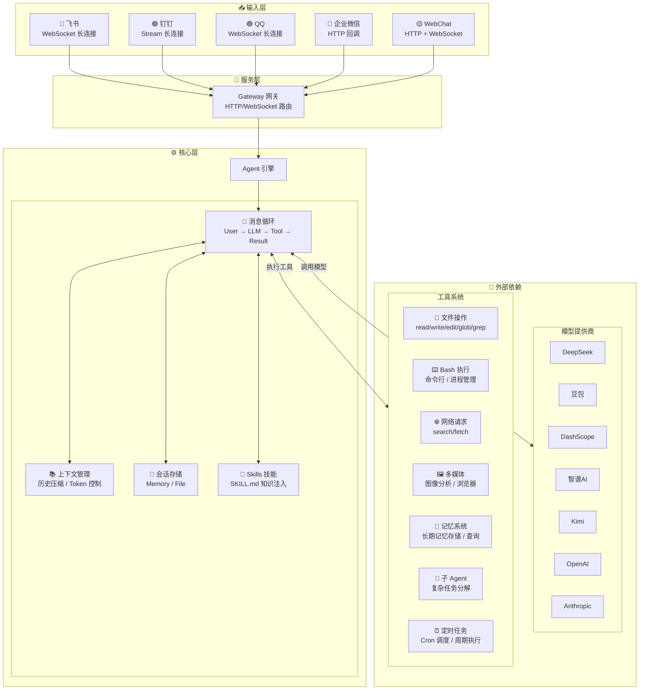
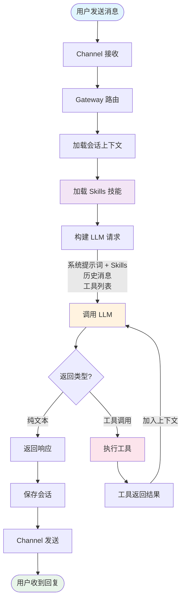

<p align="center">
  
</p>

<p align="center">
  <a href="./README_EN.md">English</a> | 中文
</p>

<table align="center">
  <tr>
    <td align="center"><sub>飞书 机器人</sub></td>
    <td align="center"><sub>QQ 机器人</sub></td>
    <td align="center"><sub>钉钉机器人</sub></td>
  </tr>
  <tr>
    <td></td>
    <td></td>
    <td></td>
  </tr>
</table>

**支持国产大模型和国产通讯软件的智能助手框架**

OpenMozi 是一个轻量级的 AI 助手框架，专注于国产生态。基于 [pi-agent-core](https://github.com/nicemicro/pi-agent-core) 构建 Agent 运行时，使用 [pi-ai](https://github.com/nicemicro/pi-ai) 作为统一的多模型调用层（支持 25+ 提供商），原生支持 Function Calling，并支持 QQ、飞书、钉钉、企业微信等通讯平台。

## 核心特性

| 模块 | 目录 | 职责 |
|------|------|------|
| **Agent** | `src/agents/` | 核心消息循环、上下文压缩、会话管理（基于 pi-agent-core） |
| **Providers** | `src/providers/` | 模型解析与映射层（基于 pi-ai，支持 25+ 提供商） |
| **Tools** | `src/tools/` | 工具注册、参数校验、执行引擎，支持自定义扩展 |
| **Skills** | `src/skills/` | 技能系统，通过 SKILL.md 注入专业知识和自定义行为 |
| **Channels** | `src/channels/` | 通道适配器，统一消息格式，支持长连接 |
| **Sessions** | `src/sessions/` | 会话持久化，支持内存/文件存储，Transcript 记录 |
| **Gateway** | `src/gateway/` | HTTP/WebSocket 服务，路由分发 |

### 上下文压缩策略

当对话历史超过 Token 限制时，OpenMozi 使用智能压缩：

1. **保留策略** — 始终保留系统提示词和最近 N 轮对话
2. **摘要压缩** — 将早期对话压缩为摘要，保留关键信息
3. **工具结果裁剪** — 截断过长的工具返回结果
4. **配对验证** — 确保 tool_call 和 tool_result 成对出现

## 核心特性

- **多模型支持** — 基于 pi-ai 统一调用层，支持 DeepSeek、豆包、DashScope (Qwen)、智谱AI、Kimi、阶跃星辰、MiniMax，以及 OpenAI/Anthropic/OpenRouter/Groq 等 25+ 提供商
- **多平台通道** — QQ、飞书、钉钉、企业微信，统一的消息处理接口
- **Function Calling** — 基于 pi-agent-core 的 Agent 运行时，原生支持工具调用循环
- **25 内置工具** — 文件读写、Bash 执行、代码搜索、网页获取、图像分析、浏览器自动化、记忆系统、定时任务等
- **Skills 技能系统** — 通过 SKILL.md 文件扩展 Agent 能力，支持自定义行为和专业知识注入
- **记忆系统** — 跨会话长期记忆，自动记住用户偏好和重要信息
- **定时任务 (Cron)** — 支持一次性、周期性、Cron 表达式三种调度方式，支持 Agent 执行和主动消息投递
- **插件系统** — 可扩展的插件架构，支持自动发现和加载
- **浏览器自动化** — 基于 Playwright 的浏览器控制，支持多配置文件和截图
- **会话管理** — 上下文压缩、会话持久化、多轮对话
- **可扩展** — 插件系统、Hook 事件、自定义工具、子 Agent

## 为什么选择 OpenMozi？

OpenMozi 的架构设计参考了 [Moltbot](https://github.com/moltbot/moltbot)，但专注于不同的使用场景：

| 特性 | OpenMozi | Moltbot |
|------|------|---------|
| **定位** | 国产生态优先的轻量框架 | 全功能个人 AI 助手 |
| **代码量** | ~16,000 行 (64 文件) | ~516,000 行 (3,137 文件) |
| **国产通讯** | QQ、飞书、钉钉、企业微信原生支持 | WhatsApp、Telegram、Slack 等 |
| **Node.js 版本** | >= 18 | >= 22 |
| **适用场景** | 企业内部机器人、国内团队协作 | 个人多设备助手、海外平台集成 |
| **学习 Agent 原理** | 代码简洁清晰，适合学习 | 代码庞大复杂，学习门槛高 |

> **OpenMozi 用 3% 的代码量实现了核心功能**，专注简洁高效，易于理解和二次开发。
> 适合 [学习 Agent 原理](#学习-agent-原理)，深入了解 AI 助手的架构设计。

## 快速开始

### 环境要求

- Node.js >= 18
- npm / pnpm / yarn
- **跨平台支持**：macOS、Linux、Windows

### 1. 安装

```bash
# 全局安装（推荐）
npm install -g mozi-bot

# 或者克隆项目开发
git clone https://github.com/King-Chau/mozi.git
cd mozi && npm install && npm run build
```

### 2. 配置

运行配置向导（推荐）：

```bash
mozi onboard
```

向导会引导你完成以下配置：
- **国产模型** — DeepSeek、豆包、智谱AI、DashScope、Kimi、阶跃星辰、MiniMax、ModelScope
- **自定义 OpenAI 兼容接口** — 支持任意 OpenAI API 格式的服务（如 vLLM、Ollama）
- **自定义 Anthropic 兼容接口** — 支持任意 Claude API 格式的服务
- **通讯平台** — QQ、飞书、钉钉、企业微信
- **记忆系统** — 启用/禁用长期记忆、自定义存储目录

配置文件将保存到 `~/.mozi/config.local.json5`。

也可以直接使用环境变量（快速体验）：

```bash
export DEEPSEEK_API_KEY=sk-your-key
```

### 3. 启动

```bash
# 仅 WebChat（无需配置 QQ/飞书/钉钉）
mozi start --web-only

# 完整服务（WebChat + QQ + 飞书 + 钉钉）
mozi start

# 克隆项目方式
npm start -- start --web-only
```

打开浏览器访问 `http://localhost:3000` 即可开始对话。

## 支持的模型提供商

> 底层基于 [pi-ai](https://github.com/nicemicro/pi-ai)，支持 25+ 模型提供商。以下为预配置的提供商，也可通过自定义接口接入任意 OpenAI/Anthropic 兼容服务。

### 国产模型

| 提供商 | 环境变量 | 说明 |
|--------|----------|------|
| DeepSeek | `DEEPSEEK_API_KEY` | 推理能力强、性价比高 |
| 豆包 | `DOUBAO_API_KEY` | 字节跳动火山引擎，Seed 深度思考系列，256k 上下文 |
| DashScope | `DASHSCOPE_API_KEY` | 阿里云灵积/百炼，通义千问商业版，稳定高并发 |
| 智谱 AI | `ZHIPU_API_KEY` | GLM-Z1/GLM-4/GLM-5 系列，清华技术团队，有免费额度 |
| ModelScope | `MODELSCOPE_API_KEY` | 阿里云魔搭社区，Qwen 开源版，有免费额度 |
| Kimi | `KIMI_API_KEY` | Kimi K2.5/Moonshot 系列，长上下文支持 |
| 阶跃星辰 | `STEPFUN_API_KEY` | Step-2/Step-1 系列，推理与多模态 |
| MiniMax | `MINIMAX_API_KEY` | MiniMax M2.5/M2.1 系列，推理能力强 |

### 海外模型

| 提供商 | 环境变量 | 说明 |
|--------|----------|------|
| OpenAI | `OPENAI_API_KEY` | GPT-4o、o1、o3 系列 |
| Anthropic | `ANTHROPIC_API_KEY` | Claude 4 系列（通过 pi-ai 内置支持） |
| OpenRouter | `OPENROUTER_API_KEY` | 聚合多家模型，统一 API |
| Together AI | `TOGETHER_API_KEY` | 开源模型托管，Llama、Mixtral 等 |
| Groq | `GROQ_API_KEY` | 超快推理速度 |
| Google | `GOOGLE_API_KEY` | Gemini 系列（通过 pi-ai 内置支持） |

### 本地部署

| 提供商 | 环境变量 | 说明 |
|--------|----------|------|
| Ollama | `OLLAMA_BASE_URL` | 本地运行开源模型 |
| vLLM | `VLLM_BASE_URL` | 高性能本地推理服务 |

### 自定义接口

支持配置任意 OpenAI 或 Anthropic 兼容的 API 接口。通过 `mozi onboard` 向导配置，或手动添加到配置文件：

```json5
{
  providers: {
    // 自定义 OpenAI 兼容接口（如 vLLM、LiteLLM 等）
    "custom-openai": {
      id: "my-provider",
      name: "My Provider",
      baseUrl: "https://api.example.com/v1",
      apiKey: "xxx",
      models: [
        {
          id: "model-id",
          name: "Model Name",
          contextWindow: 32768,
          maxTokens: 4096,
          supportsVision: false,
          supportsTools: true
        }
      ]
    },

    // 自定义 Anthropic 兼容接口
    "custom-anthropic": {
      id: "my-anthropic",
      name: "My Anthropic",
      baseUrl: "https://api.example.com",
      apiKey: "xxx",
      apiVersion: "2023-06-01",
      models: [
        {
          id: "claude-3-5-sonnet",
          name: "Claude 3.5 Sonnet",
          contextWindow: 200000,
          maxTokens: 8192
        }
      ]
    }
  }
}
```

## 通讯平台接入

QQ、飞书和钉钉都支持长连接模式，企业微信使用 Webhook 回调模式：

| 平台 | 连接模式 | 公网 IP | 接入文档 |
|------|----------|---------|----------|
| 飞书 | WebSocket 长连接 | 不需要 | [飞书接入指南](./docs/channels/feishu.md) |
| 钉钉 | Stream 长连接 | 不需要 | [钉钉接入指南](./docs/channels/dingtalk.md) |
| QQ | WebSocket 长连接 | 不需要 | [QQ 接入指南](./docs/channels/qq.md) |
| 企业微信 | Webhook 回调 | 需要 | [企业微信接入指南](./docs/channels/wecom.md) |

> **长连接模式**：无需公网 IP，无需配置回调地址，启动即可接收消息。

## 配置参考

配置文件支持 `config.local.json5`、`config.json5`、`config.yaml` 等格式，优先级从高到低。存放在 `~/.mozi/` 目录下。

<details>
<summary>完整配置示例</summary>

```json5
{
  // 模型提供商
  providers: {
    deepseek: {
      apiKey: "sk-xxx"
    },
    dashscope: {
      apiKey: "sk-xxx",
      // 可选：自定义模型列表（覆盖预设）
      models: [
        {
          id: "qwen-max-latest",
          name: "通义千问 Max",
          contextWindow: 32768,
          maxTokens: 8192
        }
      ]
    },
    zhipu: {
      apiKey: "xxx"
    },
    modelscope: {
      apiKey: "ms-xxx"
    }
  },

  // 通讯平台（长连接模式，无需公网）
  channels: {
    feishu: {
      appId: "cli_xxx",
      appSecret: "xxx"
    },
    dingtalk: {
      appKey: "xxx",
      appSecret: "xxx"
    },
    qq: {
      appId: "xxx",
      clientSecret: "xxx",
      sandbox: false  // 沙箱环境设为 true
    },
    wecom: {
      corpId: "xxx",
      corpSecret: "xxx",
      agentId: "xxx",
      token: "xxx",
      encodingAESKey: "xxx"
    }
  },

  // Agent 配置
  agent: {
    defaultProvider: "deepseek",
    defaultModel: "deepseek-chat",
    temperature: 0.7,
    maxTokens: 4096,
    systemPrompt: "你是墨子，一个智能助手。"
  },

  // 服务器配置
  server: {
    port: 3000,
    host: "0.0.0.0"
  },

  // 日志级别
  logging: {
    level: "info"  // debug | info | warn | error
  },

  // Skills 配置（可选）
  skills: {
    enabled: true,           // 是否启用技能系统（默认 true）
    userDir: "~/.mozi/skills",     // 用户级技能目录
    workspaceDir: "./.mozi/skills", // 工作区级技能目录
    disabled: ["skill-name"],      // 禁用指定技能
    only: ["skill-name"]           // 仅启用指定技能
  },

  // 记忆系统配置（可选）
  memory: {
    enabled: true,                  // 是否启用（默认 true）
    storageDir: "~/.mozi/memory"   // 存储目录（默认 ~/.mozi/memory）
  }
}
```

</details>

## Skills 技能系统

Skills 是 OpenMozi 的可扩展知识注入系统，通过编写 `SKILL.md` 文件，可以为 Agent 添加专业知识、自定义行为规则或领域能力，无需修改代码。

### 工作原理

Skills 通过 YAML frontmatter + Markdown 内容的方式定义，启动时自动加载并注入到 Agent 的系统提示词中。

### 技能加载顺序

| 优先级 | 来源 | 目录 | 说明 |
|--------|------|------|------|
| 1 | 内置 | `skills/` | 项目自带的技能 |
| 2 | 用户级 | `~/.mozi/skills/` | 用户自定义技能，所有项目共享 |
| 3 | 工作区级 | `./.mozi/skills/` | 项目级技能，仅当前项目生效 |

> 同名技能按优先级覆盖，工作区级 > 用户级 > 内置。

### 编写 Skill

每个技能是一个目录，包含一个 `SKILL.md` 文件：

```
skills/
└── greeting/
    └── SKILL.md
```

`SKILL.md` 格式：

```markdown
---
name: greeting
title: 智能问候
description: 根据时间和场景提供个性化问候
version: "1.0"
tags:
  - greeting
  - chat
priority: 10
---

当用户向你打招呼或问候时，请遵循以下规则：

1. **根据时间问候**: 根据当前时间使用合适的问候语
   - 早上 (6:00-11:00): 早上好
   - 下午 (13:00-18:00): 下午好
   - 晚上 (18:00-22:00): 晚上好

2. **友好热情**: 保持友好和积极的态度

3. **简洁明了**: 问候语简短有力
```

### Frontmatter 字段

| 字段 | 类型 | 必填 | 说明 |
|------|------|------|------|
| `name` | string | 是 | 技能唯一标识 |
| `title` | string | 否 | 显示名称 |
| `description` | string | 否 | 技能描述 |
| `version` | string | 否 | 版本号 |
| `tags` | string[] | 否 | 标签，用于分类 |
| `priority` | number | 否 | 优先级，数值越大越靠前（默认 0） |
| `enabled` | boolean | 否 | 是否启用（默认 true） |
| `eligibility.os` | string[] | 否 | 限制操作系统（darwin/linux/win32） |
| `eligibility.binaries` | string[] | 否 | 需要的命令行工具 |
| `eligibility.env` | string[] | 否 | 需要的环境变量 |

### Skills 配置

```json5
{
  skills: {
    enabled: true,             // 是否启用（默认 true）
    userDir: "~/.mozi/skills", // 用户级技能目录
    workspaceDir: "./.mozi/skills", // 工作区级技能目录
    disabled: ["greeting"],    // 禁用指定技能
    only: ["coding"]           // 仅启用指定技能（白名单模式）
  }
}
```

### ClawdHub 技能市场

OpenMozi 支持从 [ClawdHub](https://clawhub.ai) 搜索和安装社区共享的技能。安装 `clawhub` CLI 后，Agent 会自动获得搜索和安装技能的能力。

```bash
# 安装 clawhub CLI
npm i -g clawhub

# 搜索技能
clawhub search <query>

# 安装技能到 mozi 工作区目录
clawhub install <slug> --workdir ./.mozi/skills
```

> ClawdHub 安装的技能使用 moltbot 的 frontmatter 格式（`metadata.openclaw.requires`），OpenMozi 会自动兼容解析。

## 记忆系统

记忆系统让 Agent 能够跨会话记住重要信息，如用户偏好、关键事实、任务上下文等。记忆默认启用，存储在 `~/.mozi/memory/` 目录。

### 工作原理

Agent 通过三个内置工具管理记忆：

| 工具 | 说明 |
|------|------|
| `memory_store` | 存储一条新记忆（包含内容和标签） |
| `memory_query` | 根据关键词查询相关记忆 |
| `memory_list` | 列出所有已存储的记忆 |

Agent 会在对话中自动判断何时需要存储或查询记忆，无需用户手动触发。例如：

- 用户说 "我喜欢简洁的代码风格" → Agent 自动调用 `memory_store` 存储偏好
- 用户问 "我之前说过喜欢什么风格？" → Agent 自动调用 `memory_query` 查询

### 配置

```json5
{
  memory: {
    enabled: true,                  // 是否启用（默认 true）
    storageDir: "~/.mozi/memory"   // 存储目录（默认 ~/.mozi/memory）
  }
}
```

也可以通过 `mozi onboard` 向导配置记忆系统（步骤 5/5）。

### 存储结构

记忆以 JSON 文件存储，每条记忆包含内容、标签和时间戳，支持按关键词检索。

## 定时任务 (Cron)

定时任务系统让 Agent 能够按计划执行任务，支持三种调度方式和两种任务类型：

### 调度类型

| 类型 | 说明 | 示例 |
|------|------|------|
| `at` | 一次性任务 | 在 2024-01-01 10:00 执行 |
| `every` | 周期性任务 | 每 30 分钟执行一次 |
| `cron` | Cron 表达式 | `0 9 * * *` 每天 9 点执行 |

### 任务类型

| 类型 | 说明 | 用途 |
|------|------|------|
| `systemEvent` | 系统事件（默认） | 简单的提醒、触发信号 |
| `agentTurn` | Agent 执行 | 执行 AI 对话，可投递结果到通道 |

`agentTurn` 任务支持以下参数：
- `message` — Agent 执行的消息内容
- `model` — 指定使用的模型（可选）
- `timeoutSeconds` — 执行超时时间，1-600 秒（可选）
- `deliver` — 是否投递结果到通讯通道
- `channel` — 投递目标通道（dingtalk/feishu/qq/wecom）
- `to` — 投递目标 ID（用户/群组 ID）

### 使用方式

Agent 可以通过内置工具管理定时任务：

- `cron_list` — 列出所有任务
- `cron_add` — 添加新任务
- `cron_remove` — 删除任务
- `cron_run` — 立即执行任务
- `cron_update` — 更新任务状态

示例对话：
- "创建一个每天早上 9 点提醒我喝水的任务"
- "创建一个每天下午 6 点自动生成工作日报并发送到钉钉的任务"
- "10 分钟后给飞书群发送一首情诗"
- "列出所有定时任务"
- "删除名为'喝水提醒'的任务"

### 主动消息投递

定时任务支持将 Agent 执行结果主动投递到指定通讯通道，无需用户主动发起对话。

**支持的通道**：

| 通道 | 支持情况 | 配置要求 |
|------|---------|---------|
| 钉钉 | ✅ | 需配置 `robotCode` |
| 飞书 | ✅ | 仅需基本 appId/appSecret |
| QQ | ✅ (有限制) | 需用户 24 小时内与机器人有互动 |
| 企业微信 | ✅ | 需配置 agentId |

**使用示例**：

```typescript
// 通过 cron_add 工具创建 agentTurn 任务
{
  name: "每日工作日报",
  scheduleType: "cron",
  cronExpr: "0 18 * * 1-5",  // 周一到周五下午 6 点
  message: "请根据今天的工作内容生成一份简洁的工作日报",
  payloadType: "agentTurn",
  deliver: true,
  channel: "dingtalk",
  to: "群组ID或用户ID",
  model: "deepseek-chat"
}
```

### 存储

任务数据存储在 `~/.mozi/cron/jobs.json`，支持持久化。

## 插件系统

插件系统允许扩展 OpenMozi 的功能，支持自动发现和加载。

### 插件目录

| 优先级 | 来源 | 目录 | 说明 |
|--------|------|------|------|
| 1 | 内置 | `plugins/` | 项目自带插件 |
| 2 | 全局 | `~/.mozi/plugins/` | 用户安装的全局插件 |
| 3 | 工作区 | `./.mozi/plugins/` | 项目级插件 |

### 编写插件

```typescript
import { definePlugin } from "mozi-bot";

export default definePlugin(
  {
    id: "my-plugin",
    name: "My Plugin",
    version: "1.0.0",
  },
  (api) => {
    // 注册工具
    api.registerTool({
      name: "my_tool",
      description: "My custom tool",
      parameters: { type: "object", properties: {} },
      execute: async () => ({ content: [{ type: "text", text: "Hello!" }] }),
    });

    // 注册 Hook
    api.registerHook("message_received", (ctx) => {
      console.log("Message received:", ctx.content);
    });
  }
);
```

### PluginApi

| 方法 | 说明 |
|------|------|
| `registerTool(tool)` | 注册自定义工具 |
| `registerTools(tools)` | 批量注册工具 |
| `registerHook(event, handler)` | 注册事件钩子 |
| `getConfig()` | 获取插件配置 |

## 内置工具

| 类别 | 工具 | 说明 |
|------|------|------|
| 文件 | `read_file` | 读取文件内容 |
| | `write_file` | 写入/创建文件 |
| | `edit_file` | 精确字符串替换 |
| | `list_directory` | 列出目录内容 |
| | `glob` | 按模式搜索文件 |
| | `grep` | 按内容搜索文件 |
| | `apply_patch` | 应用 diff 补丁 |
| 命令 | `bash` | 执行 Bash 命令 |
| | `process` | 管理后台进程 |
| 网络 | `web_search` | 网络搜索 |
| | `web_fetch` | 获取网页内容 |
| 多媒体 | `image_analyze` | 图像分析（需要视觉模型） |
| | `browser` | 浏览器自动化（需安装 Playwright） |
| 系统 | `current_time` | 获取当前时间 |
| | `calculator` | 数学计算 |
| | `delay` | 延时等待 |
| 记忆 | `memory_store` | 存储长期记忆 |
| | `memory_query` | 查询相关记忆 |
| | `memory_list` | 列出所有记忆 |
| 定时任务 | `cron_list` | 列出所有定时任务 |
| | `cron_add` | 添加定时任务 |
| | `cron_remove` | 删除定时任务 |
| | `cron_run` | 立即执行任务 |
| | `cron_update` | 更新任务状态 |
| Agent | `subagent` | 创建子 Agent 执行复杂任务 |

## CLI 命令

```bash
# 配置
mozi onboard            # 配置向导（模型/平台/服务器/Agent/记忆系统）
mozi check              # 检查配置
mozi models             # 列出可用模型

# 启动服务
mozi start              # 完整服务（含 QQ/飞书/钉钉）
mozi start --web-only   # 仅 WebChat
mozi start --port 8080  # 指定端口

# 服务管理
mozi status             # 查看服务状态（进程数、CPU/内存、健康检查）
mozi restart            # 重启服务（支持 --web-only 等选项）
mozi kill               # 停止服务（别名：mozi stop）

# 聊天
mozi chat               # 命令行聊天

# 日志
mozi logs               # 查看最新日志（默认 50 行）
mozi logs -n 100        # 查看最新 100 行
mozi logs -f            # 实时跟踪日志（类似 tail -f）
mozi logs --level error # 只显示错误日志
```

> 日志文件存储在 `~/.mozi/logs/` 目录下，按日期自动轮转。

## 项目结构

```
src/
├── agents/        # Agent 核心（基于 pi-agent-core，消息循环、上下文压缩、会话管理）
├── channels/      # 通道适配器（QQ、飞书、钉钉、企业微信）
├── providers/     # 模型解析（基于 pi-ai，将配置映射为统一 Model 对象）
├── tools/         # 内置工具（文件、Bash、网络、定时任务等）
├── skills/        # 技能系统（SKILL.md 加载、注册）
├── sessions/      # 会话存储（内存、文件）
├── memory/        # 记忆系统
├── cron/          # 定时任务系统（调度、存储、执行器）
├── outbound/      # 主动消息投递（统一出站接口）
├── plugins/       # 插件系统（发现、加载、注册）
├── browser/       # 浏览器自动化（配置、会话、截图）
├── web/           # WebChat 前端
├── config/        # 配置加载
├── gateway/       # HTTP/WebSocket 网关
├── cli/           # CLI 命令行工具
├── hooks/         # Hook 事件系统
├── utils/         # 工具函数
└── types/         # TypeScript 类型定义

skills/            # 内置技能
├── greeting/      # 智能问候技能示例
│   └── SKILL.md
└── clawhub/       # ClawdHub 技能市场集成
    └── SKILL.md
```

## API 使用

```typescript
import { loadConfig, initializeProviders, resolveModel, getApiKeyForProvider } from "mozi-bot";
import { completeSimple } from "@mariozechner/pi-ai";

const config = loadConfig();
initializeProviders(config);

const model = resolveModel("deepseek", "deepseek-chat");
const apiKey = getApiKeyForProvider("deepseek");

const response = await completeSimple(model, {
  messages: [{ role: "user", content: "你好！", timestamp: Date.now() }],
  tools: [],
}, { apiKey });

const text = response.content
  .filter(c => c.type === "text")
  .map(c => c.text)
  .join("");
console.log(text);
```

## 学习 Agent 原理

如果你想了解 AI Agent 的工作原理，OpenMozi 是一个很好的学习项目。相比动辄几十万行代码的大型框架，OpenMozi 只有约 16,000 行代码，但实现了完整的 Agent 核心功能。

### 架构图



### 消息处理流程



### 核心模块

| 模块 | 目录 | 职责 |
|------|------|------|
| **Agent** | `src/agents/` | 核心消息循环、上下文压缩、会话管理（基于 pi-agent-core） |
| **Providers** | `src/providers/` | 模型解析与映射层（基于 pi-ai，支持 25+ 提供商） |
| **Tools** | `src/tools/` | 工具注册、参数校验、执行引擎，支持自定义扩展 |
| **Skills** | `src/skills/` | 技能系统，通过 SKILL.md 注入专业知识和自定义行为 |
| **Channels** | `src/channels/` | 通道适配器，统一消息格式，支持长连接 |
| **Sessions** | `src/sessions/` | 会话持久化，支持内存/文件存储，Transcript 记录 |
| **Gateway** | `src/gateway/` | HTTP/WebSocket 服务，路由分发 |

### 上下文压缩策略

当对话历史超过 Token 限制时，OpenMozi 使用智能压缩：

1. **保留策略** — 始终保留系统提示词和最近 N 轮对话
2. **摘要压缩** — 将早期对话压缩为摘要，保留关键信息
3. **工具结果裁剪** — 截断过长的工具返回结果
4. **配对验证** — 确保 tool_call 和 tool_result 成对出现

代码结构清晰，注释完善，适合阅读源码学习 Agent 架构设计。

### 核心功能概览

- **消息循环** — 用户输入 → LLM 推理 → 工具调用 → 结果反馈（基于 pi-agent-core）
- **上下文管理** — 会话历史、Token 压缩、多轮对话
- **工具系统** — 函数定义、参数校验、结果处理
- **记忆系统** — 跨会话长期记忆、存储与检索
- **技能系统** — SKILL.md 加载、知识注入、系统提示词扩展
- **流式输出** — SSE/WebSocket 实时响应

## 开发

```bash
# 开发模式（自动重启）
npm run dev -- start --web-only

# 构建
npm run build

# 测试
npm test
```

## Docker 部署

OpenMozi 提供完整的 Docker 部署支持，包含 Dockerfile 和 Docker Compose 配置。

### 方式一：Docker Compose（推荐）

```bash
# 构建并启动
docker compose up -d --build

# 查看日志
docker compose logs -f

# 停止服务
docker compose down
```

### 方式二：直接运行 Docker

```bash
# 构建镜像
docker build -t mozi-bot:latest .

# 运行容器（仅 WebChat）
docker run -d -p 3000:3000 mozi-bot:latest start --web-only

# 运行容器（完整模式，需配置环境变量）
docker run -d -p 3000:3000 \
  -e DEEPSEEK_API_KEY=sk-xxx \
  -e FEISHU_APP_ID=xxx \
  -e FEISHU_APP_SECRET=xxx \
  -v mozi-data:/home/mozi/.mozi \
  mozi-bot:latest
```

### 配置方式

Docker 支持两种配置方式：

1. **环境变量** — 直接在 docker-compose.yml 中配置（推荐快速体验）
2. **配置文件挂载** — 挂载 `config.local.json5` 到容器

```yaml
# docker-compose.yml 示例
services:
  mozi:
    image: mozi-bot:latest
    command: ["start", "--web-only"]  # 移除 --web-only 使用完整模式
    ports:
      - "3000:3000"
    volumes:
      - mozi-data:/home/mozi/.mozi
      # 挂载自定义配置
      - ./config.local.json5:/app/config.local.json5:ro
    environment:
      - PORT=3000
      - LOG_LEVEL=info
      # 配置模型 API Key
      - DEEPSEEK_API_KEY=sk-xxx
      # 配置通讯平台（需移除 --web-only）
      - FEISHU_APP_ID=xxx
      - FEISHU_APP_SECRET=xxx
```

### 数据持久化

数据通过 Docker volume `mozi-data` 持久化，包含：

- 日志 (`logs/`)
- 会话 (`sessions/`)
- 记忆 (`memory/`)
- 定时任务 (`cron/`)
- Skills (`skills/`)

### 健康检查

容器内置健康检查，访问 `http://localhost:3000/health`：

```json
{"status":"ok","timestamp":"2026-02-03T13:00:00.000Z"}
```

### 访问服务

启动后可通过以下地址访问：

| 服务 | 地址 |
|------|------|
| WebChat | http://localhost:3000/ |
| 控制台 | http://localhost:3000/control |
| 健康检查 | http://localhost:3000/health |

## License

Apache 2.0
