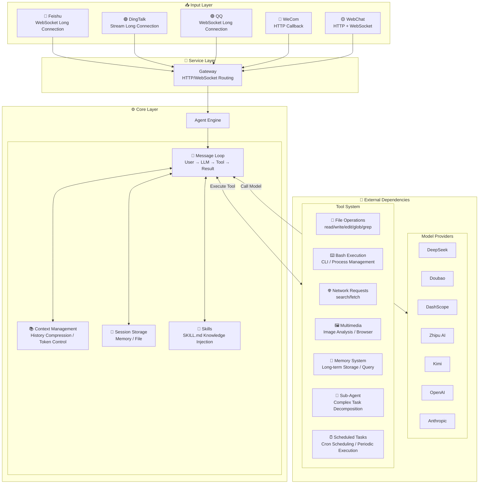
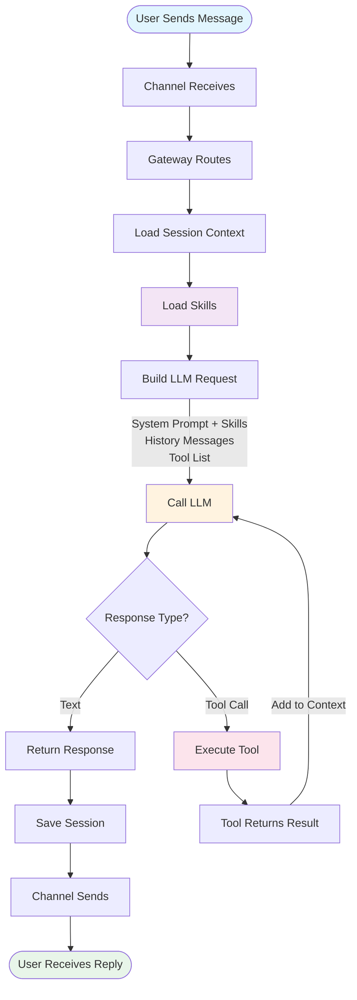

<p align="center">
  
</p>

<p align="center">
  <a href="./README_CN.md">中文</a> | English
</p>

<table align="center">
  <tr>
    <td align="center"><sub>Feishu Bot</sub></td>
    <td align="center"><sub>QQ Bot</sub></td>
    <td align="center"><sub>DingTalk Bot</sub></td>
  </tr>
  <tr>
    <td></td>
    <td></td>
    <td></td>
  </tr>
</table>

**An Intelligent Assistant Framework Supporting Chinese AI Models and Communication Platforms**

OpenMozi is a lightweight AI assistant framework focused on the Chinese ecosystem. Built on [pi-agent-core](https://github.com/nicemicro/pi-agent-core) for the Agent runtime and [pi-ai](https://github.com/nicemicro/pi-ai) as the unified multi-model calling layer (supporting 25+ providers), it natively supports Function Calling and integrates with QQ, Feishu, DingTalk, and WeCom platforms.

## Core Features

- **Multi-Model Support** — Built on pi-ai unified calling layer, supporting DeepSeek, Doubao, DashScope (Qwen), Zhipu AI, Kimi, StepFun, MiniMax, plus OpenAI/Anthropic/OpenRouter/Groq and 25+ providers
- **Multi-Platform Channels** — QQ, Feishu, DingTalk, WeCom with unified message handling interface
- **Function Calling** — Based on pi-agent-core Agent runtime, native support for tool calling loops
- **25 Built-in Tools** — File read/write, Bash execution, code search, web fetch, image analysis, browser automation, memory system, scheduled tasks, etc.
- **Skills System** — Extend Agent capabilities through SKILL.md files, supporting custom behaviors and domain knowledge injection
- **Memory System** — Cross-session long-term memory, automatically remembers user preferences and important information
- **Scheduled Tasks (Cron)** — Supports one-time, periodic, and Cron expression scheduling with Agent execution and proactive message delivery
- **Plugin System** — Extensible plugin architecture with auto-discovery and loading
- **Browser Automation** — Playwright-based browser control with multi-profile and screenshot support
- **Session Management** — Context compression, session persistence, multi-turn conversations
- **Extensible** — Plugin system, Hook events, custom tools, Sub-Agents

## Why OpenMozi?

OpenMozi's architecture is inspired by [Moltbot](https://github.com/moltbot/moltbot), but focuses on different use cases:

| Feature | OpenMozi | Moltbot |
|---------|------|---------|
| **Focus** | Chinese ecosystem-first lightweight framework | Full-featured personal AI assistant |
| **Code Size** | ~16,000 lines (64 files) | ~516,000 lines (3,137 files) |
| **Chinese Platforms** | QQ, Feishu, DingTalk, WeCom native support | WhatsApp, Telegram, Slack, etc. |
| **Node.js Version** | >= 18 | >= 22 |
| **Use Cases** | Enterprise internal bots, domestic team collaboration | Personal multi-device assistant, overseas platform integration |

> **OpenMozi achieves core functionality with 3% of the code**, focusing on simplicity and efficiency, easy to understand and extend.

## Quick Start

### Requirements

- Node.js >= 18
- npm / pnpm / yarn
- **Cross-platform Support**: macOS, Linux, Windows

### 1. Installation

```bash
# Global installation (recommended)
npm install -g mozi-bot

# Or clone for development
git clone https://github.com/King-Chau/mozi.git
cd mozi && npm install && npm run build
```

### 2. Configuration

Run the configuration wizard (recommended):

```bash
mozi onboard
```

The wizard will guide you through:
- **Chinese Models** — DeepSeek, Doubao, Zhipu AI, DashScope, Kimi, StepFun, MiniMax, ModelScope
- **Custom OpenAI-Compatible Interface** — Supports any OpenAI API format service (e.g., vLLM, Ollama)
- **Custom Anthropic-Compatible Interface** — Supports any Claude API format service
- **Communication Platforms** — QQ, Feishu, DingTalk, WeCom
- **Memory System** — Enable/disable long-term memory, custom storage directory

Configuration will be saved to `~/.mozi/config.local.json5`.

You can also use environment variables (for quick testing):

```bash
export DEEPSEEK_API_KEY=sk-your-key
```

### 3. Start

```bash
# WebChat only (no QQ/Feishu/DingTalk configuration needed)
mozi start --web-only

# Full service (WebChat + QQ + Feishu + DingTalk)
mozi start

# If cloned from repository
npm start -- start --web-only
```

Open your browser and visit `http://localhost:3000` to start chatting.

## Supported Model Providers

> Built on [pi-ai](https://github.com/nicemicro/pi-ai), supporting 25+ model providers. Below are pre-configured providers. You can also connect any OpenAI/Anthropic compatible service via custom interfaces.

### Chinese Models

| Provider | Environment Variable | Description |
|----------|---------------------|-------------|
| DeepSeek | `DEEPSEEK_API_KEY` | Strong reasoning, cost-effective |
| Doubao | `DOUBAO_API_KEY` | ByteDance Volcano Engine, Seed deep thinking series, 256k context |
| DashScope | `DASHSCOPE_API_KEY` | Alibaba Cloud Bailian, Qwen commercial version, stable high concurrency |
| Zhipu AI | `ZHIPU_API_KEY` | GLM-Z1/GLM-4/GLM-5 series, Tsinghua tech team, free tier available |
| ModelScope | `MODELSCOPE_API_KEY` | Alibaba ModelScope community, Qwen open source, free tier available |
| Kimi | `KIMI_API_KEY` | Kimi K2.5/Moonshot series, long context support |
| StepFun | `STEPFUN_API_KEY` | Step-2/Step-1 series, reasoning and multimodal |
| MiniMax | `MINIMAX_API_KEY` | MiniMax M2.5/M2.1 series, strong reasoning |

### International Models

| Provider | Environment Variable | Description |
|----------|---------------------|-------------|
| OpenAI | `OPENAI_API_KEY` | GPT-4o, o1, o3 series |
| Anthropic | `ANTHROPIC_API_KEY` | Claude 4 series (via pi-ai built-in support) |
| OpenRouter | `OPENROUTER_API_KEY` | Multi-model aggregation, unified API |
| Together AI | `TOGETHER_API_KEY` | Open source model hosting, Llama, Mixtral, etc. |
| Groq | `GROQ_API_KEY` | Ultra-fast inference speed |
| Google | `GOOGLE_API_KEY` | Gemini series (via pi-ai built-in support) |

### Local Deployment

| Provider | Environment Variable | Description |
|----------|---------------------|-------------|
| Ollama | `OLLAMA_BASE_URL` | Run open source models locally |
| vLLM | `VLLM_BASE_URL` | High-performance local inference server |

### Custom Interfaces

Supports configuring any OpenAI or Anthropic compatible API interface. Configure via `mozi onboard` wizard, or manually add to config file:

```json5
{
  providers: {
    // Custom OpenAI-compatible interface (e.g., vLLM, LiteLLM)
    "custom-openai": {
      id: "my-provider",
      name: "My Provider",
      baseUrl: "https://api.example.com/v1",
      apiKey: "xxx",
      models: [
        {
          id: "model-id",
          name: "Model Name",
          contextWindow: 32768,
          maxTokens: 4096,
          supportsVision: false,
          supportsTools: true
        }
      ]
    },

    // Custom Anthropic-compatible interface
    "custom-anthropic": {
      id: "my-anthropic",
      name: "My Anthropic",
      baseUrl: "https://api.example.com",
      apiKey: "xxx",
      apiVersion: "2023-06-01",
      models: [
        {
          id: "claude-3-5-sonnet",
          name: "Claude 3.5 Sonnet",
          contextWindow: 200000,
          maxTokens: 8192
        }
      ]
    }
  }
}
```

## Communication Platform Integration

QQ, Feishu, and DingTalk all support long connection mode, WeCom uses Webhook callback mode:

| Platform | Connection Mode | Public IP | Documentation |
|----------|-----------------|-----------|---------------|
| Feishu | WebSocket long connection | Not required | [Feishu Integration Guide](./docs/channels/feishu.md) |
| DingTalk | Stream long connection | Not required | [DingTalk Integration Guide](./docs/channels/dingtalk.md) |
| QQ | WebSocket long connection | Not required | [QQ Integration Guide](./docs/channels/qq.md) |
| WeCom | Webhook callback | Required | [WeCom Integration Guide](./docs/channels/wecom.md) |

> **Long Connection Mode**: No public IP needed, no callback URL configuration, start receiving messages immediately.

## Configuration Reference

Configuration files support `config.local.json5`, `config.json5`, `config.yaml` formats, with priority from high to low. Stored in the `~/.mozi/` directory.

<details>
<summary>Complete Configuration Example</summary>

```json5
{
  // Model providers
  providers: {
    deepseek: {
      apiKey: "sk-xxx"
    },
    dashscope: {
      apiKey: "sk-xxx",
      // Optional: custom model list (overrides presets)
      models: [
        {
          id: "qwen-max-latest",
          name: "Qwen Max",
          contextWindow: 32768,
          maxTokens: 8192
        }
      ]
    },
    zhipu: {
      apiKey: "xxx"
    },
    modelscope: {
      apiKey: "ms-xxx"
    }
  },

  // Communication platforms (long connection mode, no public IP needed)
  channels: {
    feishu: {
      appId: "cli_xxx",
      appSecret: "xxx"
    },
    dingtalk: {
      appKey: "xxx",
      appSecret: "xxx"
    },
    qq: {
      appId: "xxx",
      clientSecret: "xxx",
      sandbox: false  // Set to true for sandbox environment
    },
    wecom: {
      corpId: "xxx",
      corpSecret: "xxx",
      agentId: "xxx",
      token: "xxx",
      encodingAESKey: "xxx"
    }
  },

  // Agent configuration
  agent: {
    defaultProvider: "deepseek",
    defaultModel: "deepseek-chat",
    temperature: 0.7,
    maxTokens: 4096,
    systemPrompt: "You are Mozi, an intelligent assistant."
  },

  // Server configuration
  server: {
    port: 3000,
    host: "0.0.0.0"
  },

  // Log level
  logging: {
    level: "info"  // debug | info | warn | error
  },

  // Skills configuration (optional)
  skills: {
    enabled: true,           // Enable skills system (default true)
    userDir: "~/.mozi/skills",     // User-level skills directory
    workspaceDir: "./.mozi/skills", // Workspace-level skills directory
    disabled: ["skill-name"],      // Disable specific skills
    only: ["skill-name"]           // Enable only specific skills
  },

  // Memory system configuration (optional)
  memory: {
    enabled: true,                  // Enable (default true)
    storageDir: "~/.mozi/memory"   // Storage directory (default ~/.mozi/memory)
  }
}
```

</details>

## Skills System

Skills is OpenMozi's extensible knowledge injection system. By writing `SKILL.md` files, you can add professional knowledge, custom behavior rules, or domain capabilities to the Agent without modifying code.

### How It Works

Skills are defined using YAML frontmatter + Markdown content, automatically loaded at startup and injected into the Agent's system prompt.

### Skill Loading Order

| Priority | Source | Directory | Description |
|----------|--------|-----------|-------------|
| 1 | Built-in | `skills/` | Project built-in skills |
| 2 | User-level | `~/.mozi/skills/` | User custom skills, shared across projects |
| 3 | Workspace-level | `./.mozi/skills/` | Project-level skills, only for current project |

> Skills with same name override by priority: Workspace > User > Built-in.

### Writing Skills

Each skill is a directory containing a `SKILL.md` file:

```
skills/
└── greeting/
    └── SKILL.md
```

`SKILL.md` format:

```markdown
---
name: greeting
title: Smart Greeting
description: Provides personalized greetings based on time and context
version: "1.0"
tags:
  - greeting
  - chat
priority: 10
---

When users greet you, follow these rules:

1. **Time-based greeting**: Use appropriate greetings based on current time
   - Morning (6:00-11:00): Good morning
   - Afternoon (13:00-18:00): Good afternoon
   - Evening (18:00-22:00): Good evening

2. **Friendly and warm**: Maintain a friendly and positive attitude

3. **Concise**: Keep greetings short and powerful
```

### Frontmatter Fields

| Field | Type | Required | Description |
|-------|------|----------|-------------|
| `name` | string | Yes | Unique skill identifier |
| `title` | string | No | Display name |
| `description` | string | No | Skill description |
| `version` | string | No | Version number |
| `tags` | string[] | No | Tags for categorization |
| `priority` | number | No | Priority, higher values first (default 0) |
| `enabled` | boolean | No | Whether enabled (default true) |
| `eligibility.os` | string[] | No | Restrict to OS (darwin/linux/win32) |
| `eligibility.binaries` | string[] | No | Required CLI tools |
| `eligibility.env` | string[] | No | Required environment variables |

### Skills Configuration

```json5
{
  skills: {
    enabled: true,             // Enable (default true)
    userDir: "~/.mozi/skills", // User-level skills directory
    workspaceDir: "./.mozi/skills", // Workspace-level skills directory
    disabled: ["greeting"],    // Disable specific skills
    only: ["coding"]           // Enable only specific skills (whitelist mode)
  }
}
```

### ClawdHub Skill Marketplace

OpenMozi supports searching and installing community-shared skills from [ClawdHub](https://clawhub.ai). After installing the `clawhub` CLI, the Agent automatically gains the ability to search and install skills.

```bash
# Install clawhub CLI
npm i -g clawhub

# Search for skills
clawhub search <query>

# Install skill to mozi workspace directory
clawhub install <slug> --workdir ./.mozi/skills
```

> Skills installed from ClawdHub use moltbot's frontmatter format (`metadata.openclaw.requires`), which OpenMozi automatically parses and converts.

## Memory System

The memory system allows the Agent to remember important information across sessions, such as user preferences, key facts, task context, etc. Memory is enabled by default, stored in `~/.mozi/memory/` directory.

### How It Works

The Agent manages memory through three built-in tools:

| Tool | Description |
|------|-------------|
| `memory_store` | Store a new memory (with content and tags) |
| `memory_query` | Query related memories by keywords |
| `memory_list` | List all stored memories |

The Agent automatically determines when to store or query memories during conversation, no manual triggering needed. For example:

- User says "I prefer concise code style" → Agent automatically calls `memory_store` to save preference
- User asks "What style did I say I liked?" → Agent automatically calls `memory_query` to search

### Configuration

```json5
{
  memory: {
    enabled: true,                  // Enable (default true)
    storageDir: "~/.mozi/memory"   // Storage directory (default ~/.mozi/memory)
  }
}
```

You can also configure memory system via `mozi onboard` wizard (step 5/5).

### Storage Structure

Memories are stored as JSON files, each memory contains content, tags, and timestamp, supporting keyword search.

## Scheduled Tasks (Cron)

The scheduled task system allows the Agent to execute tasks on schedule, supporting three scheduling methods and two task types:

### Schedule Types

| Type | Description | Example |
|------|-------------|---------|
| `at` | One-time task | Execute at 2024-01-01 10:00 |
| `every` | Periodic task | Execute every 30 minutes |
| `cron` | Cron expression | `0 9 * * *` execute at 9 AM daily |

### Task Types

| Type | Description | Use Case |
|------|-------------|----------|
| `systemEvent` | System event (default) | Simple reminders, trigger signals |
| `agentTurn` | Agent execution | Execute AI conversation, can deliver results to channels |

`agentTurn` tasks support the following parameters:
- `message` — Message content for Agent to execute
- `model` — Specify model to use (optional)
- `timeoutSeconds` — Execution timeout, 1-600 seconds (optional)
- `deliver` — Whether to deliver results to communication channel
- `channel` — Target channel (dingtalk/feishu/qq/wecom)
- `to` — Target ID (user/group ID)

### Usage

The Agent can manage scheduled tasks through built-in tools:

- `cron_list` — List all tasks
- `cron_add` — Add new task
- `cron_remove` — Delete task
- `cron_run` — Execute task immediately
- `cron_update` — Update task status

Example conversations:
- "Create a task to remind me to drink water every day at 9 AM"
- "Create a task to automatically generate a work report and send it to DingTalk at 6 PM every day"
- "Send a love poem to the Feishu group in 10 minutes"
- "List all scheduled tasks"
- "Delete the task named 'water reminder'"

### Proactive Message Delivery

Scheduled tasks support proactively delivering Agent execution results to specified communication channels without users initiating conversations.

**Supported Channels**:

| Channel | Support | Configuration Requirements |
|---------|---------|---------------------------|
| DingTalk | ✅ | Requires `robotCode` configuration |
| Feishu | ✅ | Only basic appId/appSecret needed |
| QQ | ✅ (limited) | Requires user interaction with bot within 24 hours |
| WeCom | ✅ | Requires agentId configuration |

**Usage Example**:

```typescript
// Create agentTurn task via cron_add tool
{
  name: "Daily Work Report",
  scheduleType: "cron",
  cronExpr: "0 18 * * 1-5",  // 6 PM Monday to Friday
  message: "Please generate a concise work report based on today's work",
  payloadType: "agentTurn",
  deliver: true,
  channel: "dingtalk",
  to: "group_id_or_user_id",
  model: "deepseek-chat"
}
```

### Storage

Task data is stored in `~/.mozi/cron/jobs.json`, supporting persistence.

## Plugin System

The plugin system allows extending Mozi's functionality with auto-discovery and loading support.

### Plugin Directories

| Priority | Source | Directory | Description |
|----------|--------|-----------|-------------|
| 1 | Built-in | `plugins/` | Project built-in plugins |
| 2 | Global | `~/.mozi/plugins/` | User installed global plugins |
| 3 | Workspace | `./.mozi/plugins/` | Project-level plugins |

### Writing Plugins

```typescript
import { definePlugin } from "mozi-bot";

export default definePlugin(
  {
    id: "my-plugin",
    name: "My Plugin",
    version: "1.0.0",
  },
  (api) => {
    // Register tool
    api.registerTool({
      name: "my_tool",
      description: "My custom tool",
      parameters: { type: "object", properties: {} },
      execute: async () => ({ content: [{ type: "text", text: "Hello!" }] }),
    });

    // Register Hook
    api.registerHook("message_received", (ctx) => {
      console.log("Message received:", ctx.content);
    });
  }
);
```

### PluginApi

| Method | Description |
|--------|-------------|
| `registerTool(tool)` | Register custom tool |
| `registerTools(tools)` | Batch register tools |
| `registerHook(event, handler)` | Register event hook |
| `getConfig()` | Get plugin configuration |

## Built-in Tools

| Category | Tool | Description |
|----------|------|-------------|
| File | `read_file` | Read file content |
| | `write_file` | Write/create file |
| | `edit_file` | Precise string replacement |
| | `list_directory` | List directory contents |
| | `glob` | Search files by pattern |
| | `grep` | Search files by content |
| | `apply_patch` | Apply diff patch |
| Command | `bash` | Execute Bash commands |
| | `process` | Manage background processes |
| Network | `web_search` | Web search |
| | `web_fetch` | Fetch web content |
| Multimedia | `image_analyze` | Image analysis (requires vision model) |
| | `browser` | Browser automation (requires Playwright) |
| System | `current_time` | Get current time |
| | `calculator` | Math calculations |
| | `delay` | Delay wait |
| Memory | `memory_store` | Store long-term memory |
| | `memory_query` | Query related memories |
| | `memory_list` | List all memories |
| Scheduled | `cron_list` | List all scheduled tasks |
| | `cron_add` | Add scheduled task |
| | `cron_remove` | Delete scheduled task |
| | `cron_run` | Execute task immediately |
| | `cron_update` | Update task status |
| Agent | `subagent` | Create sub-Agent for complex tasks |

## CLI Commands

```bash
# Configuration
mozi onboard            # Configuration wizard (models/platforms/server/Agent/memory)
mozi check              # Check configuration
mozi models             # List available models

# Start service
mozi start              # Full service (with QQ/Feishu/DingTalk)
mozi start --web-only   # WebChat only
mozi start --port 8080  # Specify port

# Service management
mozi status             # View service status (processes, CPU/memory, health check)
mozi restart            # Restart service (supports --web-only and other options)
mozi kill               # Stop service (alias: mozi stop)

# Chat
mozi chat               # Command line chat

# Logs
mozi logs               # View latest logs (default 50 lines)
mozi logs -n 100        # View latest 100 lines
mozi logs -f            # Follow logs in real-time (like tail -f)
mozi logs --level error # Show only error logs
```

> Log files are stored in `~/.mozi/logs/` directory, auto-rotated by date.

## Project Structure

```
src/
├── agents/        # Agent core (based on pi-agent-core, message loop, context compression, session management)
├── channels/      # Channel adapters (QQ, Feishu, DingTalk, WeCom)
├── providers/     # Model resolution (based on pi-ai, maps config to unified Model objects)
├── tools/         # Built-in tools (file, Bash, network, scheduled tasks, etc.)
├── skills/        # Skills system (SKILL.md loading, registration)
├── sessions/      # Session storage (memory, file)
├── memory/        # Memory system
├── cron/          # Scheduled task system (scheduling, storage, executor)
├── outbound/      # Proactive message delivery (unified outbound interface)
├── plugins/       # Plugin system (discovery, loading, registration)
├── browser/       # Browser automation (config, sessions, screenshots)
├── web/           # WebChat frontend
├── config/        # Configuration loading
├── gateway/       # HTTP/WebSocket gateway
├── cli/           # CLI tool
├── hooks/         # Hook event system
├── utils/         # Utility functions
└── types/         # TypeScript type definitions

skills/            # Built-in skills
├── greeting/      # Smart greeting skill example
│   └── SKILL.md
└── clawhub/       # ClawdHub skill marketplace integration
    └── SKILL.md
```

## API Usage

```typescript
import { loadConfig, initializeProviders, resolveModel, getApiKeyForProvider } from "mozi-bot";
import { completeSimple } from "@mariozechner/pi-ai";

const config = loadConfig();
initializeProviders(config);

const model = resolveModel("deepseek", "deepseek-chat");
const apiKey = getApiKeyForProvider("deepseek");

const response = await completeSimple(model, {
  messages: [{ role: "user", content: "Hello!", timestamp: Date.now() }],
  tools: [],
}, { apiKey });

const text = response.content
  .filter(c => c.type === "text")
  .map(c => c.text)
  .join("");
console.log(text);
```

## Learning Agent Principles

If you want to understand how AI Agents work, OpenMozi is an excellent learning project. Compared to large frameworks with hundreds of thousands of lines of code, Mozi has only about 16,000 lines but implements complete Agent core functionality.

### Architecture Design



### Message Processing Flow



### Core Modules

| Module | Directory | Responsibility |
|--------|-----------|----------------|
| **Agent** | `src/agents/` | Core message loop, context compression, session management (based on pi-agent-core) |
| **Providers** | `src/providers/` | Model resolution and mapping layer (based on pi-ai, supporting 25+ providers) |
| **Tools** | `src/tools/` | Tool registration, parameter validation, execution engine, supports custom extensions |
| **Skills** | `src/skills/` | Skills system, inject professional knowledge and custom behaviors via SKILL.md |
| **Channels** | `src/channels/` | Channel adapters, unified message format, supports long connections |
| **Sessions** | `src/sessions/` | Session persistence, supports memory/file storage, Transcript recording |
| **Gateway** | `src/gateway/` | HTTP/WebSocket service, routing |

### Context Compression Strategy

When conversation history exceeds token limit, OpenMozi uses intelligent compression:

1. **Retention Strategy** — Always retain system prompt and last N rounds of conversation
2. **Summary Compression** — Compress early conversations into summaries, preserving key information
3. **Tool Result Trimming** — Truncate overly long tool return results
4. **Pair Validation** — Ensure tool_call and tool_result appear in pairs

The code structure is clear with complete comments, suitable for reading source code to learn Agent architecture design.

### Core Functionality Overview

- **Message Loop** — User input → LLM reasoning → Tool calling → Result feedback
- **Context Management** — Session history, Token compression, multi-turn conversations
- **Tool System** — Function definition, parameter validation, result handling
- **Memory System** — Cross-session long-term memory, storage and retrieval
- **Skills System** — SKILL.md loading, knowledge injection, system prompt extension
- **Streaming Output** — SSE/WebSocket real-time responses

## Development

```bash
# Development mode (auto-restart)
npm run dev -- start --web-only

# Build
npm run build

# Test
npm test
```

## Docker Deployment

OpenMozi provides complete Docker deployment support with Dockerfile and Docker Compose configuration.

### Method 1: Docker Compose (Recommended)

```bash
# Build and start
docker compose up -d --build

# View logs
docker compose logs -f

# Stop service
docker compose down
```

### Method 2: Direct Docker Run

```bash
# Build image
docker build -t mozi-bot:latest .

# Run container (WebChat only)
docker run -d -p 3000:3000 mozi-bot:latest start --web-only

# Run container (full mode, requires environment variables)
docker run -d -p 3000:3000 \
  -e DEEPSEEK_API_KEY=sk-xxx \
  -e FEISHU_APP_ID=xxx \
  -e FEISHU_APP_SECRET=xxx \
  -v mozi-data:/home/mozi/.mozi \
  mozi-bot:latest
```

### Configuration Options

Docker supports two configuration methods:

1. **Environment Variables** — Configure directly in docker-compose.yml (recommended for quick start)
2. **Config File Mount** — Mount `config.local.json5` to the container

```yaml
# docker-compose.yml example
services:
  mozi:
    image: mozi-bot:latest
    command: ["start", "--web-only"]  # Remove --web-only for full mode
    ports:
      - "3000:3000"
    volumes:
      - mozi-data:/home/mozi/.mozi
      # Mount custom config
      - ./config.local.json5:/app/config.local.json5:ro
    environment:
      - PORT=3000
      - LOG_LEVEL=info
      # Configure model API Key
      - DEEPSEEK_API_KEY=sk-xxx
      # Configure communication platforms (requires removing --web-only)
      - FEISHU_APP_ID=xxx
      - FEISHU_APP_SECRET=xxx
```

### Data Persistence

Data is persisted through Docker volume `mozi-data`, including:

- Logs (`logs/`)
- Sessions (`sessions/`)
- Memory (`memory/`)
- Scheduled Tasks (`cron/`)
- Skills (`skills/`)

### Health Check

The container has built-in health check, access `http://localhost:3000/health`:

```json
{"status":"ok","timestamp":"2026-02-03T13:00:00.000Z"}
```

### Accessing Services

After startup, access via:

| Service | URL |
|---------|-----|
| WebChat | http://localhost:3000/ |
| Console | http://localhost:3000/control |
| Health Check | http://localhost:3000/health |

## License

Apache 2.0
